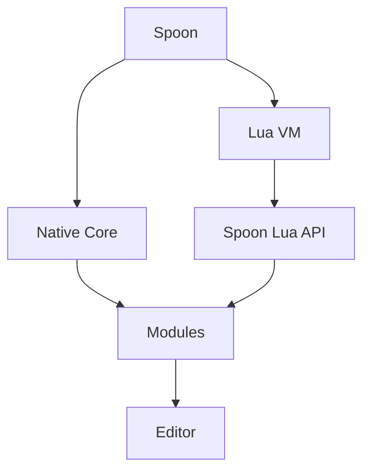

# Spoon

Spoon is an experimental editor project written in C++.

> This is something of a learning project for me. The architecture might be a bit shaky in places, so keep that in mind.

## Build

> Please note that the Linux build has **not** been tested and may not work!

To build the project, you will need:
1. **g++**
2. **Make**
3. **Git**


### Project build steps for **Windows**:

1. Clone this repository to any folder on your computer and navigate into it.

``` bash
git clone https://github.com/viskasssssss/Spoon

cd Spoon
```

2. Build the project.

``` bash
make release
```

3. If everything worked out, the result should be located at the following path: *build/release/*. 


## Status

Spoon is currently in a very early stage.

The current implementation includes:

- C++ core
- OpenGL rendering
- SDL2 windowing
- ImGui integration
- ImGui Docking
- Multi-viewport support
- Basic editor infrastructure

The architecture is still actively changing.

## Planned Architecture

One of the main ideas behind Spoon is to keep the native core as small as possible and move most editor functionality into modules.

The planned architecture looks roughly like this:



The editor itself is planned to be implemented using Spoon's Lua module system.

This should make it possible to extend or completely modify the editor without recompiling the native core.

## License

[MIT License](LICENSE)